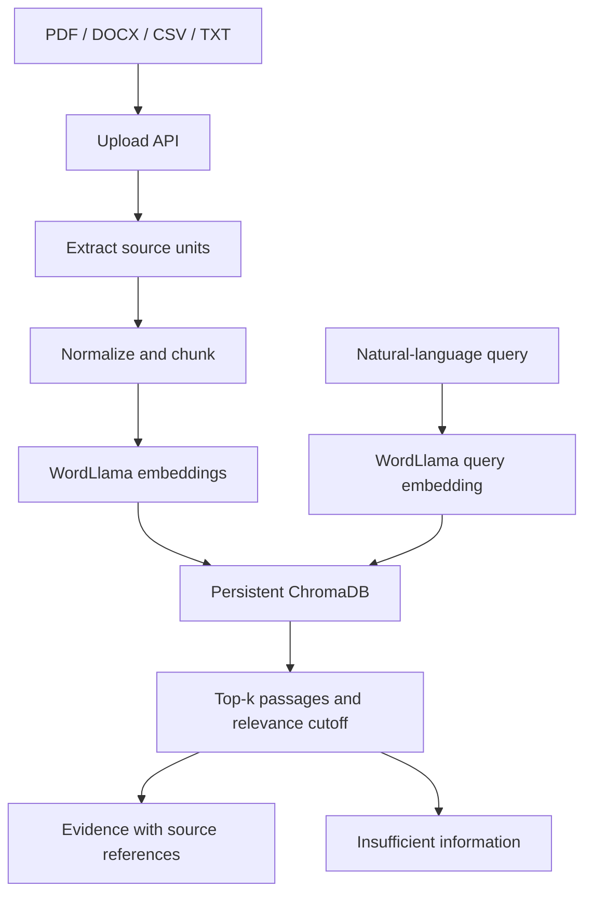

# Milestones 1 and 2 architecture

## Requirements mapping

The milestone-specific sections of the two supplied requirement documents are authoritative. Their broader project vision describes later milestones, not the current implementation scope.

| Milestone 1 requirement | Implementation | Verification |
| --- | --- | --- |
| Architecture and data models | This document, API Pydantic models | API schema and request tests |
| PDF/DOCX/CSV/TXT ingestion | `app/services/text.py`, upload route | All four fixtures via extraction, API, and live proxy |
| Normalization | Unicode NFKC, control-null removal, whitespace collapse | Normalization and empty-text tests |
| Chunking | Fixed word windows, preserving source-unit location | Boundary, overlap, full coverage, Unicode tests |
| Embeddings | `WordLlamaEmbeddings` adapter | Real vector shape, normalization, consistency, semantic ordering |
| Vector indexing | Chroma PersistentClient, cosine collection | Indexing, rollback, restart, separate-process persistence |
| Semantic retrieval | Top-k vector retrieval with cutoff | Positive queries, unrelated queries, sources, ordered scores |
| Knowledge base and frontend | Shared FastAPI service, four React routes | Component tests, build, live HTTP smoke |

## Processing flow

Milestone 1 supplies the retrieval foundation of RAG. The implemented Milestone 2 extension adds the extraction/provider path described below. An embedding model represents text as vectors; it is not a conversational LLM.

## Source tree

- `backend/app/core/config.py`: fixed settings and persistent-data path.
- `backend/app/api/schemas.py`: structured document, upload, summary, retrieval, and health models.
- `backend/app/api/router.py`: REST endpoints.
- `backend/app/services/text.py`: independent extraction, normalization, and chunking.
- `backend/app/services/embeddings.py`: replaceable embedding protocol and WordLlama implementation.
- `backend/app/services/knowledge_base.py`: indexing, metadata manifest, rollback/recovery, and retrieval.
- `backend/app/main.py`: startup wiring and safe API error handler.
- `frontend/src/api.ts`: typed API boundary.
- `frontend/src/components/UI.tsx`: reusable headings, statuses, source tables, and empty/error states.
- `frontend/src/pages/`: Overview, Documents, Knowledge Base, Retrieval, ScopeDeliverables, RiskDelivery, BlockersActions, and shared AgentAnalysis.
- `backend/tests/`, `frontend/src/App.test.tsx`, `frontend/src/Agents.test.tsx`: regression and agent validation.
- `tests/test_live_application.py`: real-server checks through the Vite proxy.
- `samples/`: four controlled project documents.
- `scripts/`: fixture creation and actual-server smoke test.

## Data models and provenance

A document manifest record contains UUID, filename, extension, upload byte count, timestamp, processing state, indexed flag, chunk count, and optional readable error. It is stored atomically in `documents.json` under the data directory. This manifest is operational metadata, not a second vector database.

Every Chroma record stores a unique `<document-uuid>:chunk-<number>` ID, chunk text, 256-dimensional vector, original filename, document type, document UUID, chunk number, chunk ID, and source location. PDF locations are pages; DOCX locations are body-block/row references; CSV locations are end-line numbers; TXT locations are sections. These are extraction locators, not interactive original-file downloads.

Filenames are sanitized to basenames and are never used as disk paths. Same-name uploads receive separate UUIDs. Original uploaded bytes are processed in memory; normalized evidence persists in Chroma.

## Fixed configuration

| Setting | Value | Reason |
| --- | --- | --- |
| Chunk words | 180 | Bounded passages for document retrieval |
| Word overlap | 30 | Retain context across window boundaries |
| Source boundaries | Never cross page/block/row/section | Keep source location precise |
| Embedding | WordLlama `l2_supercat`, dimension 256 | Required model family; isolated adapter |
| Similarity | Cosine; vectors normalized | Comparable query/document representations |
| Minimum similarity | 0.16 | Calibrated on the provided controlled fixtures |
| Retrieval count | 5 in UI; API 1–10 | Keep review focused |
| File limit | 10 MB each, 20 per batch | Bound demo workload |
| Expanded DOCX limit | 50 MB | Reject oversized expanded archives |
| Embedding/index batch | 64 chunks | Bound peak vector allocation |

Short source units form short chunks. The configuration lives in code and is not exposed as sliders. Changing the embedding model/dimension requires a new collection name and re-ingestion; do not mix incompatible vector spaces.

## Status, atomicity, and errors

Uploads are processed independently and sequentially within a batch. The manifest records processing status before extraction. The interface polls the summary while an upload runs. It shows each failure and allows uploading a corrected file. A bad file does not prevent later files from being processed.

A process-wide lock serializes ingestion and retrieval to avoid retrieving partially added documents. A separate lock protects the manifest. Failed ingestion removes that document's Chroma records. On startup, interrupted processing records are marked failed and their partial vectors are removed. This is a single-process design; multiple worker processes are not supported.

Malformed requests return validation errors. Unexpected API failures return a generic message, with details only in backend logs. Model-load failures fail startup. No TF-IDF or alternate embedding fallback is implemented.

## Retrieval and insufficient information

An empty collection returns insufficient information immediately. Otherwise Chroma retrieves top-k nearest vectors. Results below 0.16 cosine similarity are omitted. If no passage remains, the response status is `insufficient_information`. Otherwise `ok` means candidate passages were retrieved, not that an answer has been proven.

Calibration run: the best milestone score was about 0.175, versus unrelated-query maxima around 0.112–0.143. A 0.32 cutoff rejected valid evidence; 0.16 retained the expected passages while rejecting the three controlled unrelated queries. This narrow calibration margin is documented rather than presented as general accuracy. Queries asking for an unstated detail in the same topic can retrieve related evidence; user review remains necessary. The retrieval page returns source passages; the separate agent pages return validated source statements.

## API

| Method | Path | Result |
| --- | --- | --- |
| GET | `/api/health` | Loaded backend/model status |
| POST | `/api/documents/upload` | Per-file indexed/error records |
| GET | `/api/documents` | All document statuses |
| GET | `/api/knowledge-base` | Counts, formats, sources, readiness |
| POST | `/api/retrieval/query` | Evidence or insufficient-information result |

## Milestone 2 integration

The three agents share the approved Milestone 1 retrieval service. Provider and grounding modules are separate from ingestion and storage. Existing REST paths and persisted collection settings remain compatible. Milestone 2 is implemented and awaits user approval.

## Reference implementation documentation

- [WordLlama official repository](https://github.com/dleemiller/WordLlama)
- [Chroma official repository](https://github.com/chroma-core/chroma)

The tested installed package APIs were also inspected during implementation.

## Milestone 2 implementation update — 12 September 2026

The three agents are implemented within this same application. No second ingestion pipeline or vector database is introduced.

### Agent separation

| Agent | Module | Structured categories |
| --- | --- | --- |
| Scope and Deliverable Extraction | `app/agents/scope_deliverables.py` | goals, milestones, timelines, responsibilities, deliverables |
| Risk Detection and Delivery Forecasting | `app/agents/risk_forecast.py` | schedule risks, dependency gaps, delivery challenges, stated delivery outlook |
| Blocker and Action Item Identification | `app/agents/blockers_actions.py` | pending decisions, unresolved issues, action items |

Each independent agent uses the shared `GroundedAgent` pipeline and the `AnalysisProvider` protocol. Blocker retrieval explicitly targets meeting notes and progress/sprint updates. Existing ingestion and vector storage are reused unchanged.

### Retrieval and processing

The user's focus and complementary facet queries call Milestone 1 semantic retrieval, each with top-k=5. Scope uses four facet queries; the other agents use three. An unrelated focus with no initial evidence returns insufficient information. The generic command to review project documents is treated as an operation, so its facet queries still run when the wording of that command does not semantically match document content.

Results are deduplicated and selected round-robin across retrieval facets, with a maximum of 12 unique passages and 14,000 characters. Source text is not truncated again to fit the agent budget. No agent reads or sends the entire Chroma collection. A small knowledge base can naturally fit within the selected evidence, but large stores remain bounded.

The provider selects exact statement segments and category labels. The server then validates the schema, checks each evidence ID against the actual retrieved set, verifies each quote against the segmented retrieved text, validates that the category is supported by the conservative extraction rules, and derives optional fields only from that quote. Provider output cannot add a free-form owner/date/forecast field. An invalid finding rejects the entire response rather than returning a mixture of verified and unverified findings.

### Provider architecture

- `app/llm/base.py`: interface, provider status, safe provider errors.
- `app/llm/provider.py`: local extraction, configurable HTTP chat-completions provider, and explicit unavailable state.
- `app/agents/prompts.py`: bounded JSON evidence, schema instructions, and separation of untrusted source data from system instructions.
- `app/agents/grounding.py`: output validation.
- `app/agents/extraction.py`: transparent local rules and source-derived fields.

Default `extractive` mode combines real WordLlama retrieval with deterministic statement selection. It is not an LLM. `openai_compatible` mode uses backend environment configuration for base URL, model, and optional API key. Requests require JSON-object responses. Remote URLs require HTTPS; local loopback can use HTTP. Calls time out, do not follow redirects, and bound model response bytes to 1 MiB. The provider does not silently switch modes after failure.

[Chat-completions protocol reference](https://developers.openai.com/api/reference/resources/chat). The configured endpoint must support the required JSON behavior; protocol tests use mocked HTTP, not a live external model.

### Structured fields and uncertainty

The response contains agent, status, provider, focus, timestamp, findings, used evidence, category coverage, retrieved count, budget-limited flag, and warnings. A finding contains category, exact quote, retrieved evidence ID, known/unclear state, optional owner, optional due date, literal dates, source status, explicitly stated severity, and the nonnumeric provenance label `explicit_source_statement`.

Dates remain source strings; no relative date is converted into a guessed calendar date. Responsibility and owner are extracted only from recognized explicit assignments. An action with an unrecognized or absent owner/date is unclear with null fields. Category coverage is known, unclear, or missing. Overall status is `ok`, `partial`, or `insufficient_information`.

The delivery agent quotes explicitly stated delay consequences, forecasts, or uncertainty. Reasons and affected milestones remain in their exact quoted context. It does not estimate probabilities, select severity without evidence, or manufacture a revised delivery date. Conflicting source statements remain visible as separate findings; automatic conflict resolution is not implemented.

### Additional API and interface

| Method | Path | Purpose |
| --- | --- | --- |
| GET | `/api/agents/status` | Report runtime mode and configuration readiness |
| POST | `/api/agents/scope` | Scope extraction |
| POST | `/api/agents/risk` | Risk and stated delivery outlook |
| POST | `/api/agents/blockers` | Blockers, decisions, and actions |

Agent requests accept a bounded query; top-k remains fixed at 5. Pydantic rejects extra fields and malformed requests. Grounding rejection returns HTTP 502, provider/configuration failure returns HTTP 503, and unexpected failures retain the existing sanitized error handler. Insufficient information is a successful HTTP 200 domain result.

Dedicated `ScopeDeliverables.tsx`, `RiskDelivery.tsx`, and `BlockersActions.tsx` pages map to `/scope`, `/risks`, and `/blockers`. Each uses `AgentAnalysis.tsx` for consistent evidence rendering, with distinct task descriptions and analysis focus. Sidebar groups are WORKSPACE, MILESTONE 1, and MILESTONE 2. It displays runtime mode, loading/error/empty/insufficient states, known/unclear/missing coverage, source quotations, null values as "Not stated", and expandable evidence metadata. Changing pages clears prior agent results. Overview links to the three agents without health scores or a future aggregate dashboard.

## Project layout choices

The project root is `AI-Project-Intelligence/`. Existing Milestone 1 routes stay in `app/api/router.py`; new routes stay in `app/api/agents.py`. Retrieval stays in `KnowledgeBaseService`. These intentionally preserve the existing architecture instead of duplicating route and retrieval modules to match an illustrative tree. Agent names describe their actual responsibilities. See `PROJECT_FILES.md` for the complete directory tree and every deliverable file.
